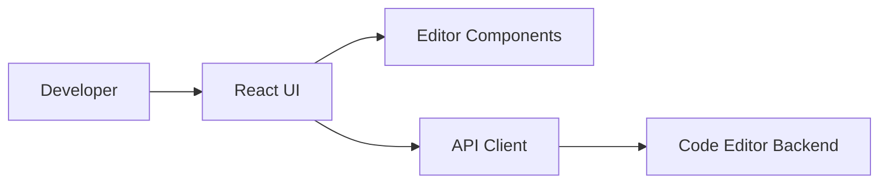

<div align="center">

# 🧑‍💻 Code Editor Frontend

**A browser interface for creating, browsing, and editing code projects.**

[](https://developer.mozilla.org/) [](https://react.dev/) [](https://code-editor-front-nine.vercel.app)

</div>

## ✨ Overview

The frontend delivers an editor-first experience and connects to `code-editor-backend` for project and file operations.

## 🚀 Features

- Code editing workspace
- Project and file navigation
- Responsive interface
- Backend API integration
- Clear extension point for previews and collaboration

## 🧱 Architecture



## 🖼️ Screenshots


> Add the screenshot at `docs/screenshots/editor.png`, or replace this link with a deployed image.

## ⚡ Run locally

```bash
npm install
npm run dev
```

Build and preview:

```bash
npm run build
npm run preview
```

## 🔧 Configuration

Configure the backend base URL using the frontend environment variable expected by the API client.

## 📄 License

MIT License.
